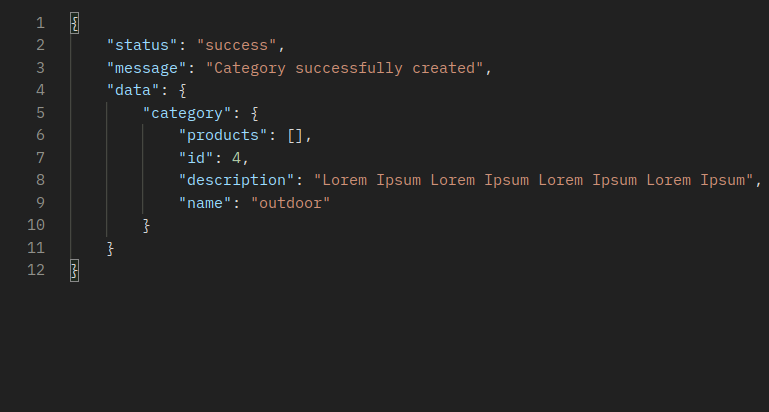
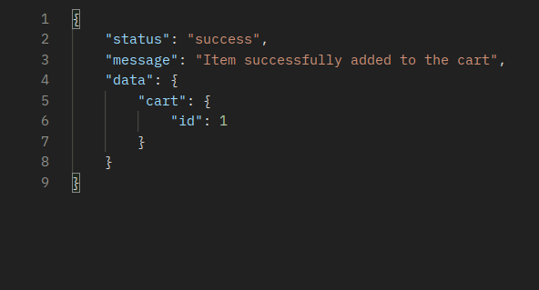

# Prateek Khindri's T2A2 API Webserver Project - Sneaker Connect 2 Sided Marketplace

# **Installation Instructions**

**Connect to a PostgreSQL database from the Flask application by executing the following command:**

```SQL
psql
```

**Creating the database:**

```bash
CREATE DATABASE sneaker_connect_db;
```

**Connecting to the database:**

```bash
\c sneaker_connect_db
```

**Create a user and set a temporary password by executing:**

```bash
CREATE USER api_dev WITH PASSWORD 'password123';
```

**Grant all priviliges:**

```bash
GRANT ALL PRIVILEGES ON DATABASE sneaker_connect_db TO api_dev;
```

**Open another WSL command line and execute the following commands:**

**To create and activate a virtual environment:**

```bash

python3 -m venv ./venv

source venv/bin/activate

```

**Installing required dependencies:**

```bash
pip3 install -r requirements.txt
```

**Rename the .env.sample to .env and set the variables below**

```
SECRET_KEY

API_KEY

SQLALCHEMY_DATABASE_URI

RESTX_VALIDATE
```

**Create and seed the database by executing the commands below**

```bash
flask db-cli create
flask db-cli seed
```

**Execute the command below to clear all tables**

```bash
flask db-cli clear
```

**Execute the command below to drop all tables**

```bash
flask db-cli drop
```

**Execute to command below and follow the command line prompts to create an admin user**

```bash
flask db-cli admin
```

**Execute the command below to run the flask application**

```bash
flask run
```

**This should allow you to open 127.0.0.1:5000/ on your browser or through [Postman](https://www.postman.com/).**

# R1: Identification of the problem you are trying to solve by building this particular app

As in other areas of the world, the sneaker market in Australia has experienced tremendous growth in recent years, driven by factors such as the advent of athleisure, the rising importance of personal style, and the expansion of sneaker culture.

The lack of a comprehensive online platform that connects buyers and sellers of sneakers on the Australian market is the issue that this two-sided marketplace API aims to address. To buy and sell sneakers, sneaker enthusiasts often rely on social media platforms or overseas markets, which can be time-consuming and unreliable. In addition, many of these platforms demand excessive fees or do not offer enough consumer protection, resulting in a lack of confidence in the online sneaker marketplace.

To address these issues, this 2-sided marketplace API provides a platform specifically designed for sneaker buyers and sellers in Australia. The platform is designed to be user-friendly and secure, providing features that meet the unique needs of the sneaker market.

Overall, this 2-sided marketplace API for sneakers is intended to address the Australian market's absence of a comprehensive, user-friendly, and secure online platform for buyers and sellers of sneakers. This platform intends to connect buyers and sellers of sneakers across Australia and establish a thriving online sneaker marketplace ecosystem in the country.

# R2: Why is it a problem that needs solving?

The need for a 2-sided marketplace API for sneakers in Australia stems from several factors such as fashion trends, the rise of sneaker culture, an increased focus on personal style and the the lack of a dedicated and comprehensive online platform for buying and selling sneakers. Addressing these challenges through the implementation of a two-sided marketplace is crucial for fostering growth, enhancing customer experiences, and ensuring the long-term viability of the sneaker market in Australia.

1. ### **Satisfying the Surging Need for Sneakers**

   - As the Australian sneaker market continues to expand, it is necessary to solve the sector's inefficiencies and restrictions. Traditional means of linking sneaker enthusiasts with retailers, such as physical storefronts and marketing, are unable to keep up with the increasing demand for sneakers, resulting in wasted chances for both buyers and sellers. By introducing a digital marketplace, sneaker enthusiast's demands and tastes may be matched with the products offered by retailers in a more effective manner, assuring the market's continued growth.

2. ### **Adapting to Changing Customer Preferences**

   - Influenced by variables such as fashion trends, brand partnerships, and the growing significance of individual style, sneaker enthusiast's preferences are always changing. To accommodate these shifting preferences, it is essential to develop a platform that can adapt to consumer demands and deliver a varied selection of products. This flexibility is made possible by a webserver API for a two-sided marketplace, enabling shops to present a vast selection of sneakers, including niche and exclusive products, to fulfil the different needs of sneaker fans. Failing to accommodate these developing consumer preferences may lead to a stagnant market in which retailers are unable to successfully meet the needs of their target audience.

3. ### **Streamlining the Customer Journey**

   - In today's fast-paced, digitally-driven society, people place a greater emphasis on convenience and efficacy when shopping. These expectations are not met by the fragmented nature of the present sneaker business, as buyers must navigate several platforms to find the footwear they seek. By creating a uniform platform, the customer journey can be streamlined, allowing sneaker fans to browse, compare, and purchase goods with ease. Failing to handle the fragmented customer experience may result in consumer unhappiness and decreased market engagement, hence impeding the growth potential of the market.

4. ### **Promoting Transparency and Fair Competition**

   - In Australia, the sneaker market is characterised by increased prices due to reasons such as low supply and reselling. In addition, the lack of pricing transparency across platforms makes it difficult for customers to locate the best bargains and for businesses to compete effectively on price. It is possible to encourage fair competition and price transparency by implementing a two-sided marketplace,  ensuring that customers can make educated purchasing decisions and retailers can compete on a level playing field. These challenges must be addressed in order to retain consumer confidence and promote healthy market competition, both of which are vital for the market's long-term success.

5. ### **Combating Fake Products and Developing Trust**

   - The presence of counterfeit products in the sneaker market weakens consumer confidence and presents difficulties for retailers who must invest in establishing their credibility. It is possible to combat the issue of counterfeit products and generate trust among sneaker enthusiasts by establishing a trustworthy and secure digital marketplace. While customers are more inclined to engage in transactions when they have confidence in the platform and its sellers, addressing this issue is crucial for preserving the market's integrity and supporting long-term growth.

# R3: Why have you chosen this database system. What are the drawbacks compared to others?

I have chosen _PostgreSQL (PSQL)_ for the development of this 2-sided marketplace webserver API for several reasons. _PostgreSQL_ is an open-source, object-relational database management system (ORDBMS) widely used in web applications, including Flask. It is well-known for its robustness, stability, and reliability in managing data (Viloria et al., 2019). PostgreSQL is a versatile, feature-rich DBMS used for various web applications, from small websites to large-scale web applications. In addition to its utility in high-level data analysis, it is an excellent option for analytically-intensive web applications. It has been around for over 30 years and has a strong and active community of developers who regularly release updates and improvements.

## **Pros**

- **Open Source**

  - One of the advantages of _PostgreSQL_ is that it is an open-source software, meaning it is free to use and available to the public. This makes it a desirable option for developers who wish to create applications without incurring license fees. In addition, _PSQL's_ open-source nature means that it benefits from a large, active developer community that contributes to its enhancement and provides significant support resources.

- **Reliability**

  - It is also highly secure and reliable and provides vital data integrity. _PostgreSQL_ supports many advanced features, such as stored procedures, triggers, full-text search, and foreign key constraints (Zimányi et al., 2020). It is is ACID (Atomicity, Consistency, Isolation, Durability) compliant, which ensures data consistency, which is critical for maintaining trust and smooth operations.

- **Data Types**

  - It also provides various data types, including JSON and XML. _PostgreSQL_ is also highly extensible, allowing developers to write their data types, functions, and operators (Viloria et al., 2019).

- **Scalability**

  - _PostgreSQL_ is highly scalable and can handle large amounts of data efficiently. It is also very flexible and supports distributed queries, allowing users to query data from multiple databases (Zimányi et al., 2020). As the two-sided marketplace grows and attracts more users, it is essential that the chosen database system can accommodate the increased demand.

- **Extensible**

  - _PostgreSQL_ supports various programming languages such as Python, Java, Perl and Ruby making it easy for developers to create complex web applications (Viloria et al., 2019).

- **Integration**

  - It is also supported by many web application frameworks, such as Django, Ruby on Rails, and Node.js, making it easy to integrate into web applications (Zimányi et al., 2020).

- **Community Support**

  - _PostgreSQL_ has a big and active developer and user community, which means there are numerous learning, troubleshooting, and problem-solving tools available. The community also produces an abundance of extensions, plugins, and modules for enhancing _PostgreSQL's_ functionality.

## **Drawbacks**

- **Complexity**

  - _PostgreSQL_ can be difficult to learn and use, as it has a steep learning curve. PostgreSQL is a feature-rich database; yet, its extensive features and capabilities can make it more difficult to use and administer than other DBMS's. This may make it less appropriate for smaller web applications or applications with less requirements. In addition, this complexity may lead to increased development time and costs.

- **Performance**

  - _PostgreSQL_ does not have as many features as other database systems, such as Oracle and Microsoft SQL Server. It is also slower than other database systems, such as MySQL when dealing with large amounts of data. This can become problematic in applications with a large number of write transactions.

- **Adaptability and NOSQL Options**

  - NoSQL databases, such as MongoDB and Cassandra, provide better data storage and schema design freedom than relational databases, such as PostgreSQL. NoSQL databases may be preferable for applications with quickly changing data structures or a requirement for fast write performance.

- **Limited Commercial Assistance**

  - _PostgreSQL_ also needs more support for distributed transactions, which can cause problems when dealing with large amounts of data. Despite being an open-source database, _PostgreSQL_ does not have the same amount of commercial support as Oracle or Microsoft SQL Server.

# R4: Identify and discuss the key functionalities and benefits of an ORM

_Object-relational mapping (ORM)_ is a programming approach that streamlines the interaction between object-oriented programming languages and relational databases. ORM libraries provide a layer of abstraction, allowing developers to interact with databases using the same object-oriented paradigms they use to create and manipulate objects in their prefered programming language, rather than writing complex SQL queries. The fundamental function of an _ORM_ is to map objects in the programming language to database tables, enabling developers to interact with the database using a more natural and expressive syntax.

## **Key Functionalities**

- **Database Table to Object Class Mapping**

  - _ORM's_ ability to map database tables to object classes in the programming language is one of its main features. This mapping permits developers to interact with database tables as if they were native objects, with column representations as object attributes and row representations as object instances. This representation is more natural for object-oriented programmers, making it simpler for them to comprehend and manipulate the data.

- **Data Querying and Retrieval**

  - _ORM_ libraries often provide a high-level, object-oriented query API that enables developers to design and execute database queries using the same syntax and constructs they employ when working with objects in their programming language. This API abstracts away the intricacies of SQL and makes code more readable and manageable. In addition, ORM libraries typically allow a broad variety of query operations, such as filtering, ordering, aggregation, and joining, ensuring that developers have the tools necessary to retrieve and manipulate data efficiently.

- **Record Insertion, Modification, and Deletion**

  - In addition to querying, ORM frameworks support the insertion, modification, and deletion of database records. Using simple object-oriented methods, developers can create new object instances, adjust their properties, and then persist the changes to the database. This feature simplifies the process of working with database records and decreases the risk of introducing errors due to complex SQL commands.

- **Control of Transactions and Concurrency**

  - Typically, ORM frameworks offer support for transactions and concurrency control, enabling developers to execute numerous database operations atomically and reliably. This functionality is especially crucial for applications with multiple users or concurrent processes that must ensure data integrity and consistency. By abstracting away the intricacies of transaction management and concurrency control, ORM frameworks allow developers to concentrate on the application's fundamental business logic.

- **Lazy and Eager Loading**

  - Frequently, ORM libraries provide techniques for regulating the loading of related data, such as foreign key associations between tables, to manage the loading of related data. Lazy loading delays the retrieval of associated data until it is explicitly requested, whereas eager loading retrieves all associated data in advance. This feature enables developers to optimise the performance of their application by eliminating unnecessary database queries and limiting the amount of data loaded into memory.

## **Key Benefits**

- **Increased Productivity and Maintainability of Code**

  - ORM frameworks considerably increase developer productivity by providing a high-level, object-oriented API for working with databases. Developers are able to produce less lines of code that is more readable and maintainable. This higher productivity might result in accelerated development cycles and decreased development expenditures.

- **Abstraction of Database-Specific Details**

  - ORM libraries hide database-specific features, enabling developers to work with databases in a uniform, unified manner regardless of the underlying database management system. Although the majority of the code remains intact, this abstraction makes it easy to switch between databases or move an application to a new database system.

- **Decreased Probability of SQL Injection Attacks**

  - ORM libraries can lessen the danger of SQL injection attacks, a frequent security weakness in database-driven applications, by utilising high-level, parameterized query APIs. As developers are not need to manually design SQL queries and concatenate user input, the probability of introducing vulnerabilities is reduced. The parameterized queries employed by ORM libraries handle user input sanitization automatically, ensuring that potentially harmful user input is correctly escaped and neutralised.

- **Enhanced Code Reusability**

  - ORM facilitates code reuse by allowing developers to design modular, reusable classes that represent database tables and their relationships. These classes can be readily shared and reused across various application components or even between projects, hence decreasing the amount of code that must be written and maintained.

- **Simplified Schema Migration and Development**

  - Frequently, ORM libraries offer tools and processes for managing schema changes and migrations, making it simpler to adapt the database schema as application requirements expand. These technologies can automate the generation and application of database migrations, ensuring that the schema remains in sync with the application code and minimising the possibility of schema update failures.

- **Better Testability**

  - ORM libraries simplify the creation of unit tests and integration tests for database-driven applications by offering a standard, object-oriented API for working with databases. Developers can create test fixtures and mock objects that represent database tables and records more easily, allowing them to comprehensively test the behavior of their application in isolation from the actual database.

# R5: Document all endpoints for your API

## Auth Related Operation Routes

### **Buyer Signup**

**`/auth/signup/buyer/`**

- Methods: POST

- Arguments: None

- Description: User register or signup

- Authentication: None

- Authorization: None

- Request Body:


- Request Response:


### **Seller Signup**

**`/auth/signup/seller/`**

- Methods: POST

- Arguments: None

- Description: Register or signup as a seller

- Authentication: None

- Authorization: None

- Request Body:


- Request Response:


### **Login**

**`/auth/login/`**

- Methods: POST

- Arguments: None

- Description: Route for a user to login. Returns the user email and JWT access token required for authentication

- Authentication: None

- Authorization: None

- Request Body:


- Request Response:


### **Reset Password**

**`/auth/reset-password/`**

- Methods: PATCH

- Arguments: None

- Description: Route for a user to update their password

- Authentication: `@token_required()`

- Authorization: The `token` needs to be sent as an authorization header

- Request Body:


- Request Response:


### **User Logout**

**`/auth/logout/`**

- Methods: GET

- Arguments: None

- Description: Route for a user to logout of their account

- Authentication: `@token_required()`

- Authorization: The `token` needs to be sent as an authorization header

- Request Body: None

- Request Response:


## User Related Operation Routes

### **User Profile View**

**`/user/{username}/`**

- Methods: GET

- Arguments: None

- Description: Route for a user to view their profile with their username

- Authentication: `@token_required()`

- Authorization: The `token` needs to be sent as an authorization header

- Request Body: None

- Request Response:


### **Delete A User**

**`/user/{username}/`**

- Methods: DELETE

- Arguments: None

- Description: Route for an admin to delete a user

- Authentication: `@token_required()` `@permission_required()`

- Authorization: The `token` needs to be sent as an authorization header - only an admin user can access this route

- Request Body:


- Request Response:


### **Update User Profile**

**`/user/{username}/`**

- Methods: PATCH

- Arguments: None

- Description: Route for a user to update their profile

- Authentication: `@token_required()`

- Authorization: The `token` needs to be sent as an authorization header

- Request Body:


- Request Response:


### **Promote User to Admin**

**`/user/promote-admin/`**

- Methods: POST

- Arguments: None

- Description: Route for promoting a users account to an admin account

- Authentication: `@token_required()` `@permission_required()`

- Authorization: The `token` needs to be sent as an authorization header - only an admin user can access this route

- Request Body:


- Request Response:


### **Get all Users From Database**

**`/user/all-users/`**

- Methods: GET

- Arguments: None

- Description: Route for retrieving all users from the database

- Authentication: `@token_required()` `@permission_required()`

- Authorization: The `token` needs to be sent as an authorization header - only an admin user can access this route

- Request Body: None

- Request Response:


### **Get all Buyers From Database**

**`/user/all-users/buyer/`**

- Methods: GET

- Arguments: None

- Description: Route for retrieving all users from the database

- Authentication: `@token_required()` `@permission_required()`

- Authorization: The `token` needs to be sent as an authorization header - only an admin user can access this route

- Request Body: None

- Request Response:


### **Get all Sellers From Database**

**`/user/all-users/seller/`**

- Methods: GET

- Arguments: None

- Description: Route for retrieving all sellers from the database

- Authentication: `@token_required()` `@permission_required()`

- Authorization: The `token` needs to be sent as an authorization header - only an admin user can access this route

- Request Body: None

- Request Response:


### **Get all Admins From Database**

**`/user/all-users/admin/`**

- Methods: GET

- Arguments: None

- Description: Route for retrieving all admin users from the database

- Authentication: `@token_required()` `@permission_required()`

- Authorization: The `token` needs to be sent as an authorization header - only an admin user can access this route

- Request Body: None

- Request Response:


### **Get All Seller Listed Products**

**`/user/<string:username>/products`**

- Methods: GET

- Arguments: None

- Description: Route for getting all products from the database that belong to a specific seller.

- Authentication: `@token_required()` `@permission_seller()`

- Authorization: The `token` needs to be sent as an authorization header - only a seller can access this route

- Request Body: None

- Request Response:


### **Create Product**

**`/user/<string:username>/product`**

- Methods: POST

- Arguments: None

- Description: Route for creating a product by a seller.

- Authentication: `@token_required()` `@permission_seller()`

- Authorization: The `token` needs to be sent as an authorization header - only a seller can access this route

- Request Body:


- Request Response:


### **Update Product**

**`/user/<string:username>/product`**

- Methods: PATCH

- Arguments: None

- Description: Route for updating a product by a seller.

- Authentication: `@token_required()` `@permission_seller()`

- Authorization: The `token` needs to be sent as an authorization header - only a seller can access this route

- Request Body:


- Request Response:


### **Delete Product**

**`/user/<string:username>/product`**

- Methods: DELETE

- Arguments: None

- Description: Route for deleting a product by a seller.

- Authentication: `@token_required()` `@permission_seller()`

- Authorization: The `token` needs to be sent as an authorization header - only a seller can access this route

- Request Body:


- Request Response:


## Product Related Operation Routes

### **Get Single Product**

**`/product/<int:id>/`**

- Methods: GET

- Arguments: `id`

- Description: Route for getting a single product with the product id.

- Authentication: None

- Authorization: None

- Request Body: None

- Request Response:


### **Get All Products**

**`/product/`**

- Methods: GET

- Arguments: None

- Description: Route for getting all products from the database.

- Authentication: None

- Authorization: None

- Request Body: None

- Request Response:


### **Search For a Product**

**`/product/search/?name=`**

- Methods: GET

- Arguments: `name`

- Description: Route for searching a product from the database. The product name needs to be sent as part of the query params

- Authentication: None

- Authorization: None

- Request Body: None

- Request Response:


## Brand Related Operation Routes

### **Create Brand**

**`/brand/`**

- Methods: POST

- Arguments: None

- Description: Route for creating a brand by an admin.

- Authentication: `@token_required()` `@permission_required()`

- Authorization: The `token` needs to be sent as an authorization header - only an admin user can access this route

- Request Body:


- Request Response:


### **Update Brand**

**`/brand/<int:brand_id>`**

- Methods: PUT

- Arguments: `brand_id`

- Description: Route for updating a brand by an admin.

- Authentication: `@token_required()` `@permission_required()`

- Authorization: The `token` needs to be sent as an authorization header - only an admin user can access this route

- Request Body:


- Request Response:


### **Delete Brand**

**`/brand/<int:brand_id>`**

- Methods: DELETE

- Arguments: `brand_id`

- Description: Route for deleting a brand by an admin.

- Authentication: `@token_required()` `@permission_required()`

- Authorization: The `token` needs to be sent as an authorization header - only an admin user can access this route

- Request Body: None

- Request Response:


### **Get All Brands**

**`/brand/`**

- Methods: GET

- Arguments: None

- Description: Route for fetching all brands from the database.

- Authentication: None

- Authorization: None

- Request Body: None

- Request Response:


### **Get Single Brand**

**`/brand/<int:brand_id>`**

- Methods: GET

- Arguments: `brand_id`

- Description: Route for fetching a single brand from the database with the `brand_id`.

- Authentication: None

- Authorization: None

- Request Body: None

- Request Response:


## Category Related Operation Routes

### **Create Category**

**`/category/`**

- Methods: POST

- Arguments: None

- Description: Route for creating a category by an admin.

- Authentication: `@token_required()` `@permission_required()`

- Authorization: The `token` needs to be sent as an authorization header - only an admin user can access this route

- Request Body:


- Request Response:



### **Update Category**

**`/category/<int:category_id>`**

- Methods: PUT

- Arguments: `category_id`

- Description: Route for updating a category by an admin.

- Authentication: `@token_required()` `@permission_required()`

- Authorization: The `token` needs to be sent as an authorization header - only an admin user can access this route

- Request Body:


- Request Response:


### **Delete Category**

**`/category/<int:category_id>`**

- Methods: DELETE

- Arguments: `category_id`

- Description: Route for deleting a category by an admin.

- Authentication: `@token_required()` `@permission_required()`

- Authorization: The `token` needs to be sent as an authorization header - only an admin user can access this route

- Request Body: None

- Request Response:


### **Get All Categories**

**`/category/`**

- Methods: GET

- Arguments: None

- Description: Route for fetching all categories from the database.

- Authentication: None

- Authorization: None

- Request Body: None

- Request Response:


### **Get Single Category**

**`/brand/<int:category_id>`**

- Methods: GET

- Arguments: `category_id`

- Description: Route for fetching a single category from the database with the `category_id`.

- Authentication: None

- Authorization: None

- Request Body: None

- Request Response:


## Cart Related Operation Routes

### **Get User Cart**

**`/cart/`**

- Methods: GET

- Arguments: None

- Description: Route for fetching a users cart.

- Authentication: `@token_required()`

- Authorization: The `token` needs to be sent as an authorization header

- Request Body: None

- Request Response:


### **Add Product to Cart**

**`/cart/`**

- Methods: POST

- Arguments: None

- Description: Route for adding products/items to a users cart.

- Authentication: `@token_required()`

- Authorization: The `token` needs to be sent as an authorization header

- Request Body:


- Request Response:



### **Delete Product from Cart**

**`/cart/items/<int:cart_item_id>`**

- Methods: DELETE

- Arguments: `cart_item_id`

- Description: Route for deleting items from a users cart.

- Authentication: `@token_required()`

- Authorization: The `token` needs to be sent as an authorization header

- Request Body: None

- Request Response:


## Address Related Operation Routes

### **Get All User Addresses**

**`/address/`**

- Methods: GET

- Arguments: None

- Description: Route for fetching all user addresses from the database.

- Authentication: `@token_required()`

- Authorization: The `token` needs to be sent as an authorization header

- Request Body: None

- Request Response:


### **Get Specific User Address**

**`/address/<int:address_id>`**

- Methods: GET

- Arguments: `address_id`

- Description: Route for fetching a specific user address from the database.

- Authentication: `@token_required()`

- Authorization: The `token` needs to be sent as an authorization header

- Request Body: None

- Request Response:


### **Create User Address**

**`/address/`**

- Methods: POST

- Arguments: None

- Description: Route for creating a user address.

- Authentication: `@token_required()`

- Authorization: The `token` needs to be sent as an authorization header

- Request Body:


- Request Response:


### **Updating User Address**

**`/address/<int:address_id>`**

- Methods: PUT

- Arguments: `address_id`

- Description: Route for updating a user address.

- Authentication: `@token_required()`

- Authorization: The `token` needs to be sent as an authorization header

- Request Body:


- Request Response:


### **Deleting User Address**

**`/address/<int:address_id>`**

- Methods: DELETE

- Arguments: `address_id`

- Description: Route for deleting a user address.

- Authentication: `@token_required()`

- Authorization: The `token` needs to be sent as an authorization header

- Request Body: None

- Request Response:


# R6: An ERD for your app


# R7: Detail any third party services that your app will use

### **Flask**

- Flask is a lightweight web framework for Python that provides a simple way to build web applications. It is designed to be easy to use, extensible, and efficient, making it an excellent choice for small to medium-sized projects or for developers looking to quickly prototype a web application. Flask's modular architecture allows us to include only the components we need, keeping the application lean and easy to maintain.

### **Flask-SQLAlchemy**

- Flask-SQLAlchemy is an extension for Flask that simplifies the integration of SQLAlchemy, a popular Object Relational Mapper (ORM) for Python, into Flask applications. Flask-SQLAlchemy provides a convenient and easy-to-use interface for creating, querying, and updating database records using Python objects and classes. It also includes features for managing database connections, transactions, and migrations.

### **Psycopg2**

- Psycopg2 is a PostgreSQL adapter for Python. It allows you to connect to PostgreSQL databases and perform SQL operations using Python. Psycopg2 is a popular choice for PostgreSQL integration due to its efficiency, compatibility with various PostgreSQL features, and support for advanced functionality like asynchronous queries and server-side cursors.

### **Flask-Migrate**

- Flask-Migrate is an extension that simplifies the management of database schema migrations in Flask applications using SQLAlchemy. It is built on top of Alembic, a lightweight database migration tool for SQLAlchemy. Flask-Migrate provides a command-line interface and integration with Flask-Script or Flask-CLI, allowing us to manage schema changes and database migrations through a series of versioned scripts.

### **Flask-restx**

- Flask-restx is an extension for Flask that simplifies the development of RESTful APIs. It provides a straightforward way to define API endpoints, request and response data structures, and input validation. Flask-restx also generates interactive API documentation using Swagger, making it easy for developers and users to understand and test the API.

### **Flask-Marshmallow**

- Flask-Marshmallow is an extension for Flask that integrates the Marshmallow library, a popular serialization and deserialization library for Python. Flask-Marshmallow simplifies the process of converting complex data types, like Python objects, into JSON or other content types, and vice versa. It is particularly useful for validating, serializing, and deserializing data in RESTful APIs.

### **Flask-bcrypt**

- Flask-bcrypt is an extension for Flask that provides bcrypt hashing utilities for password storage and verification. Bcrypt is a popular password hashing algorithm that is designed to be slow and computationally expensive, making it more resistant to brute-force attacks. Flask-bcrypt allows us to easily hash and verify passwords in our Flask application, improving security and protecting user data.

### **Python-dotenv**

- Python-dotenv is a Python library that allows us to load environment variables from a `.env` file into our application's environment. This can be helpful for managing sensitive configuration data, like API keys and database credentials, separate from the application code. Flask applications can use python-dotenv to load environment variables during initialization, ensuring that sensitive data remains secure and easily manageable.

### **Flask-JWT-Extended**

- Flask-JWT-Extended is an extension for Flask that provides JSON Web Token (JWT) support for authentication and authorization. JWT's are a secure and stateless method for authenticating users and transmitting information between parties. Flask-JWT-Extended simplifies the process of generating, decoding, and verifying JWTs in a Flask application, making it easier to implement secure authentication and authorization mechanisms.

### **Flask-filter**

- Flask-filter is an extension for Flask that provides a simple and flexible way to add filtering capabilities to a Flask application's API endpoints. It works with SQLAlchemy-based applications and allows us to define custom filtering rules based on request query parameters. This makes it easy for clients to request specific subsets of data from an API, improving the flexibility and efficiency of an application.

### **Flask-session**

- Flask-session is an extension for Flask that provides server-side session management. By default, Flask uses client-side cookies for session management, which may not be suitable for all applications, especially those with strict security requirements. Flask-session allows us to store session data on the server-side using various storage options, such as Redis, Memcached, or the filesystem. This can improve the security and scalability of a Flask application by offloading session management to a centralized storage system.

### **PyJWT**

- PyJWT is a Python library that allows us to encode, decode, and verify JSON Web Tokens (JWTs). JWTs are a compact, URL-safe means of representing claims to be transferred between two parties. They are commonly used for authentication and authorization in web applications. While Flask-JWT-Extended is a Flask-specific extension that integrates JWT support, PyJWT is a more general-purpose library that can be used independently of Flask to work with JWTs in various contexts.

# R8: Describe your projects models in terms of the relationships they have with each other

### **User Model**

- The users table stores the user data such as their name, email, password, username, phone number and two Boolean columns (is_admin & is_seller) to distinguish if a user is a seller, admin or a buyer

- This table is connected to other tables in the database like products, addresses and carts


### **Product Model**

- The products table stores information about the name of a listed product, its description, price, discount price, available quantity and rating

- This table is connected to other tables in the database like the `cart_items`

- Foreign Keys

  - `seller_id`: Listed product associated with the seller

  - `category_id`: Listed product belongs to which category

  - `brand_id`: Listed product belongs to which brand


### **Category Model**

- The categories table stores information such as the name and description of a specific category

- This table is connected to other tables in the database like the products


### **Brand Model**

- The brands table stores information such as the name and description of a specific brand

- This table is connected to other tables in the database like the products


### **Cart Model**

- The carts table stores information such as the `id` and `user_id`

- This table is connected to other tables in the database like the cart_items

- Foreign Keys

  - `user_id`: An existing cart belongs to which user


### **CartItem Model**

- The cart_items table stores information such as the `id`, `cart_id`, `product_id` and quantity

- This table is a `joining table` between the carts and the products table

- Foreign Keys

  - `product_id`: To identify which product is part of a specific cart item

  - `cart_id`: To identify that the cart item belongs to which cart


### **Address Model**

- The addresses table stores information such as street_address, suburb, state and postcode for a particular user

- Foreign Keys

  - `user_id`: To identify that the address belongs to which user


# R9: Discuss the database relations to be implemented in your application

### **Users - Products**

- The Users table has a one-to-many relationship with the products table

- This is because a single user can have many products however a single product can only belong to one user

### **Users - Addresses**

- The User table has a one-to-many relationship with the addresses table

- This is because a single user can have zero, one or multiple addresses, however a one address must only belong to one user

### **Users - Carts**

- The Users table has a one-to-one relationship with the carts table, as a single user can only have one cart

### **Categories - Products**

- The Categories table has a one-to-many relationship with the products table

- This is because a single category can have zero, one or multiple products, however a product must belong to atleast one category

### **Brands - Products**

- The Brands table has a one-to-many relationship with the products table

- This is because a single brand can have zero, one or multiple products, however a product must belong to at least one brand

### **Carts - Products**

- The Carts table has a many-to-many relationship with the products table

- This is because a cart can contain many different items and a product can be a part of many different carts

- This is why a `joining table` of `cart_items` is useful to keep track of the cart and cart items

# R10: Describe the way tasks are allocated and tracked in your project

The [Trello](https://trello.com/) project management platform was used to manage the application's implementation plan and design. I was successful at planning, prioritising, and organising my activities into digestible portions.


### **An _Agile_ based sprint board can be created as depicted below :**

- ### **Backlog**

  - Includes the tasks that must be completed for a project

- ### **In Development**

  - Includes tasks that must be completed or are being worked on.

- ### **Ready For Test**

  - Includes tasks that are completed and are in the testing phase

- ### **Product Walkthrough**

  - Includes tasks for a senior team-member to review before presenting it to the client for feedback

- ### **Ready For Release**

  - Includes tasks/features ready for client feedback

- ### **Done**

  - Includes all completed tasks

However, I did not include the _`Product Walkthrough`_ and _`Ready For Release`_ lists in my board. In addition, each task was color-coded according to priority, with red representing high priority, orange representing medium priority, and yellow representing low priority. In addition, for each activity, a checklist of checklist items was provided, which aided in breaking down the tasks into smaller components. Finally, each job was assigned a serial number, which made it much easier to make frequent commits to a remote repository.

The color-coded scheme is depicted below.


## **Managing and Tracking Tasks: How I Succeeded**

- Using labels and color coding to categorise tasks

- Utilising a checklist for each item or task

- Setting up due dates to track the progress of each task

- Reviewing and updating the board regularly

- Writing and participating in stand ups with my peers and educators on Discord

A link to the [Trello](https://trello.com/) workspace can be found [here](https://trello.com/b/ZWcOWMxs/t2a2-api-webserver-project)

```
https://trello.com/b/ZWcOWMxs/t2a2-api-webserver-project
```

# References:

- Yang, J., Subramaniam, P., Lu, S., Yan, C. and Cheung, A., 2018, May. How not to structure your database-backed web applications: a study of performance bugs in the wild. In Proceedings of the 40th International Conference on Software Engineering (pp. 800-810). Available at: https://doi.org/10.1145/3180155.3180194 [Accessed 16 March. 2023]

- Ma, L., Van Aken, D., Hefny, A., Mezerhane, G., Pavlo, A. and Gordon, G.J., 2018, May. Query-based workload forecasting for self-driving database management systems. In Proceedings of the 2018 International Conference on Management of Data (pp. 631-645). Available at: https://doi.org/10.1145/3183713.3196908 [Accessed 16 March. 2023]

- Code Institute. (2021). Object-Relational Mapping. Available at: https://codeinstitute.net/global/blog/object-relational-mapping/ [Accessed 16 March. 2023]

- Shukla, S. (2019). What is an ORM and Why You Should Use It. Bit Blog. Available at: https://blog.bitsrc.io/what-is-an-orm-and-why-you-should-use-it-b2b6f75f5e2a [Accessed 16 March. 2023]
